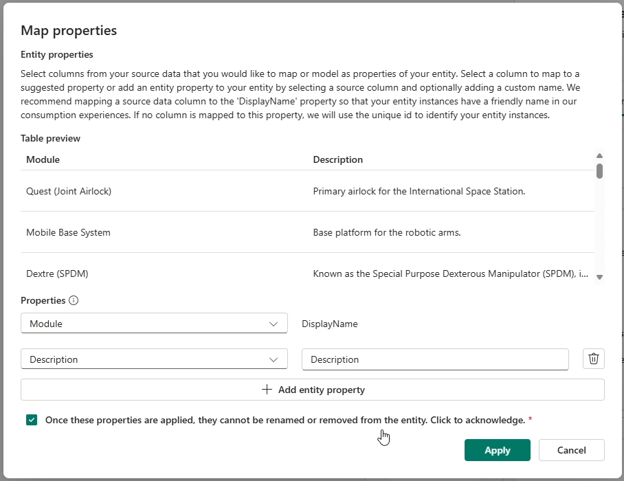
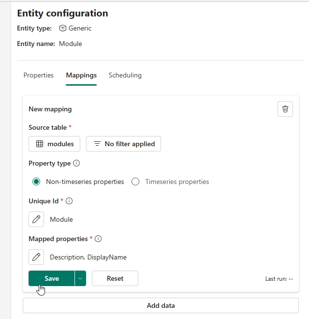
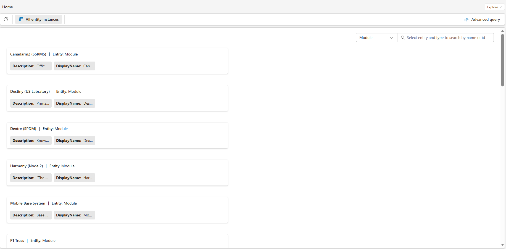

# Overview
Welcome to the USD Import and Export Demo for DTB. This demo leverages the OpenUSD libraries to extract relevant 3D metadata from within a file, and allows users to contexualize 3D alongside traditional IT and OT Data. We aim to provide an intitial "Getting Started" jumpstart point for users wishing to include 3D Files within their digital twin data estate.

This repo aims both to provide the Notebook and flow on how users can contextualize their own 3D, as well as a demo to show how this is possible. The demo uses data from the International Space Station representing a series of Modules, and a 3D Model provided by NASA with embedded metadata within the file.

# Table of Contents
* [Getting Started](#Getting*Started)
* [Prerequisites and Setup](#Prerequisites)
* [Running the Notebook](#Runnning*the*Notebook)
* [Next Steps](#Next*Steps)
* [Appendix](#appendix)

# Getting Started
This repo makes use of a few core pieces of software:

### Microsoft Fabric
[Microsoft Fabric](https://www.microsoft.com/en*us/microsoft*fabric) is an end*to*end, unified analytics platform designed to bring together all data and analytics tools into one place. It aims to provide a single environment for data professionals and business users to collaborate on data projects, covering everything from data ingestion and storage to processing and analysis.

### Digital Twin Builder
Within Fabric, the core technology leveraged is the Digital Twin Builder (DTB) from Fabric Realtime Intelligence. (FIX)**We do some Ontologies and stuff**: [Documentation](#www.google.com)

### OpenUSD
[OpenUSD](https://openusd.org/release/index.html) is a file standard for extending and interchanging 3D Formats. Originally designed by Pixar for use in the SFX world, it has since grown traction in the Industrial space as a fantastic file format for interchanging 3D, as well as enriching 3D with relevant semantic information and metadata.

# Prerequisites and Digital Twin Setup
* Microsoft Fabric Instance
* 3D File/s
* Digital Twin Builder, with Mapped Entities related to the 3D file.

*For the sake of this demo, we are providing the steps to set up DTB, as well as a 3D file within the Repo.*

We will need to prepare Fabric, and our DTB instance so we can match our files within it. Within this repo are three Files

* modules.csv: A table of modules within the ISS.
* disciplines.csv: (Optional) a table of Disciplines representing the Flight Desk in charge of the modules in the ISS.
* iss.usd:  A 3D File of the ISS.
* USDtoDTB.ipynb: The notebook including relevant code to run this Demo.

### Fabric Prep
1. Create new Workspace within Fabric
2. Create a Lakehouse within Fabric
    * *Within the Workspace, click 'New Item' in the top left and look for 'Lakehouse'
3. In the top Left of the Workspace, click 'Import..' and Select 'Notebook > From this Computer'
    * Select the USDtoDTB Notebook from your Local Machine
4. Upload the following files into the Lakehouse
    * modules.csv
    * iss.usd
5. Under the 'Files' Directory, right click on 'modules.CSV' and load this into 'New Table'. You can leave this called modules.

### Digital Twin Builder Preparation
We will be creating a series of Modules within our Digital Twin instance to represent the physical [Modules of the International Space Station](https://en.wikipedia.org/wiki/Assembly_of_the_International_Space_Station#Assembly_sequence). The uploaded Modules table has all the relevant info we need to create a series of twins from this data.

1. Create a new 'Digital Twin Builder' Item
    * *Within the Workspace, click 'New Item' in the top left and look for 'Digital Twin Builder'

*Once in the Digital Twin Builder, we will create two Entities*

2. Click 'Add Entity' and name this Entity 'Module'. This will create Entity Instances of the various Modules on the ISS
3. Click 'Add Entity' and name this Entity '3DGeometry'. This will contain Entity Instances for each 3D Representation found within the 3D file.
4. Click on the Entity 'Module' and click on 'Mappings' Tab, Click 'Add Data' within the tab
5. Within the new window that appears, click 'Select Lakehouse Table'
6. Select the Lakehouse created above, and teh 'Modules' table within it.
7. For 'Unique ID' select 'Module'
    * The Unique ID is our Unique Identifier for any Entity Instances that get created.
8. For Under 'Mapped Properties' select:
    * 'Module' for DisplayName 
    * Add a new field, create 'Description' for Description
    * Click Apply once done
9. Save this config, and go to the 'Scheduling' Tab and run this mapping job now.

*the Module Mapping Config should look as follows*

After a few minutes, you may want to click 'Explore' in the top right of the DTB Canvas to view the created Entity Instances, you may monitor the Mapping job by clicking 'Manage Operations' on the toolbar.

*The created Module Entity Instances within the 'Explore' Screen*

#### (Optional), Adding ISS Flight Control positions to Twin
While this demo will work fine as we are linking Modules <> 3D Assets, a Digital Twin contains more than just one piece of data, to flesh this out, we have included a list of the [Flight Controllers](https://en.wikipedia.org/wiki/List_of_NASA%27s_flight_control_positions#ISS_flight_control_positions_2010%E2%80%93present) that are in charge of various physical modules within the ISS.

1. Click 'Add Entity' and name this Entity 'Discipline'. This will create Entity Instances of the various Disciplines that manage the ISS
2. Click on the Entity Discipline and click on 'Mappings' Tab, Click 'Add Data' within the tab
3. Within the new window that appears, click 'Select Lakehouse Table'
4. Select the Lakehouse created above, and the 'Discipline' table within it.
5. For 'Unique ID' select 'Discipline'
    * The Unique ID is our Unique Identifier for any Entity Instances that get created.
6. For Under 'Mapped Properties' select:
    * 'Discipline' for DisplayName
    * Add a new field, create 'Module' for Module
7. Save this config, and go to the 'Scheduling' Tab and run this mapping job now.

Now we can create the Relationship

1. click on the three dots next to the Discipline entity and select 'Add Relationship'
2. Within the First Entity box, make sure 'Discipline' is selected, for Property to Join select 'Module'
3. For the Second Entity, select 'Module' and for Property to Join, select DisplayName.
4. Call this relationship 'ControlledBy'
5. For Relationship type, select 'Many Modules per Discipline (1:N)' 
6. click 'Run Now' to run this contextualization job and join the two entities together.

# Running the Notebook
With the following steps, we will extract any relevant metadata embeded within the 3D file, from here we will run the notebook to extract the data, and configure the 3DGeometry Twin and Relationship to the Modules data above.

## Import USD to DTB
The notebook is going to run a few tasks
1. Load USD File for prep
2. Extract specified asset metadata
3. Convert Asset metadata into tabular format and save this as a table

Once these steps have been run, we will head over to DTB to configure a new Asset, Mapping and Contextualization Job.

### Notebook Steps
1. Open the 'USDtoDTB' notebook from your Workspace
2. On the left, click 'Add Data Items' and add in the Lakehouse from the previous steps.
3. Within the first cell of the notebook, specify the '3dfile' variable point to the uploaded iss.usd file from earlier
    * this may be in the path of */lakehouse/default/Files/iss.usd*
4. Run the following Cells *(for more information on what each of these steps are doing, please see the appendix)*
    * Set Stage USD File
    * Import Libraries
    * Extract & Metadata Table
    * View Extracted Data

From here, you may view the output of the metadata extracted from the USD FIle, If you are happy this table can be saved within the Lakehouse, and Ingested similar to our earlier modules table.

5. Run the following cells
    * Save to Table

## Mapping Exported USD to DTB

Now that we have a table, we can go through standard DTB mapping phases to create our file, and link this to the Entities.

1. Open the DTB Item from the workspace
4. Click on the 3DGeometry Entity and click on 'Mappings' Tab, Click 'Add Data' within the tab
5. Within the new window that appears, click 'Select Lakehouse Table'
6. Select the Lakehouse created above, and the 'issues' table within it.
7. For 'Unique ID' select 'AssetId'
8. For 'Mapped Properties' 
    * select 'Asset' for DisplayName, 
    * select sourcePath, leave this name as Sourcepath
    * click 'Apply' once done.
9. Save this config, and go to the 'Scheduling' Tab and run this mapping job now. 

We can now create the relationship between the two data structures

1. click on the three dots next to the 3DGemoetry and select 'Add Relationship'
2. Within the First Entity box, make sure '3DGeometry' is selected, for Property to Join select 'DisplayName'
3. For the Second Entity, select 'Module' and for Property to Join, select DisplayName.
4. Call this relationship 'RepresentedBy'
5. For Relationship type, select 'Many 3DGeometry per Module (N:1)'

Once created, run this Contextualization job immediately.

## Exploring Results
Once all jobs have been run (check 'Manage Operations' within DTB to confirm status) we confirm matches within the notebook by clickin 'Explore' in the top right and searching for the Destiny Module.

By looking at this, it should have the relevant SourcePath associated to it, this SourcePath is its true representation within the USD file. We can now associate the Entity Instance ID (or other details) into the USD file as they are now attached by this SourcePath.

## Export DTB Metadata to USD
Within the notebook, we can also export the Model from DTB into a new USD file with the embedded asset metadata. This would allow us to embed information from the Digital Twin model back into the USD. We can use this information as a reference for 3D applications to query fabric from, or embedding static information or constraints within the file for jobs such as Simulation.

1. Open the same 'USDtoDTB' notebook from your Workspace
2. Specify the USD file you wish to enrich with the Twin data.
4. Run the following Cells
    * Export DTB Model

From here you may wish to query the extracted table and its mappings to the relevant USD SourcePaths. If all is okay..

5. Run the following Cells
    * Write to USD file

This will create an enriched USD file. You may want to inspect this using such tools as [USD Composer](https://docs.omniverse.nvidia.com/composer/latest/index.html), [USDView](https://openusd.org/release/toolset.html#usdview) or even [Blender](https://www.blender.org/).

## Conclusion
With Import, we have extracted relevant 3D Metadata embedded within the scene, this can be handy for relating these geospatial concepts
AFter export, we have a 3D file with an embedded AssetID value, this value can be used a a query point to link the 3D Geometry to its relevant Twin representation within DTB. This can now be used in 3D applications as a key to query relevant information.

## Next Steps
Want to render this within Nvidia Omniverse? Check out [Nvidia Omniverse Digital Operations Twin](https://github.com/microsoft/NVIDIA*Omniverse*Azure*Operations*Twin). A demo to get you up and running with operational twins in Azure, using an enriched USD file created from this process.

## Appendix
### Notebook Steps
(FIX)We do some notebook stuff