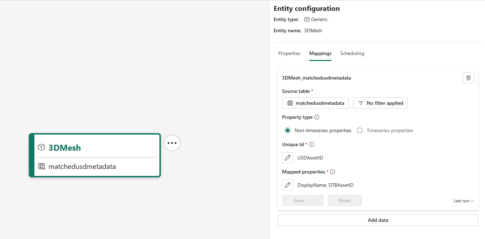
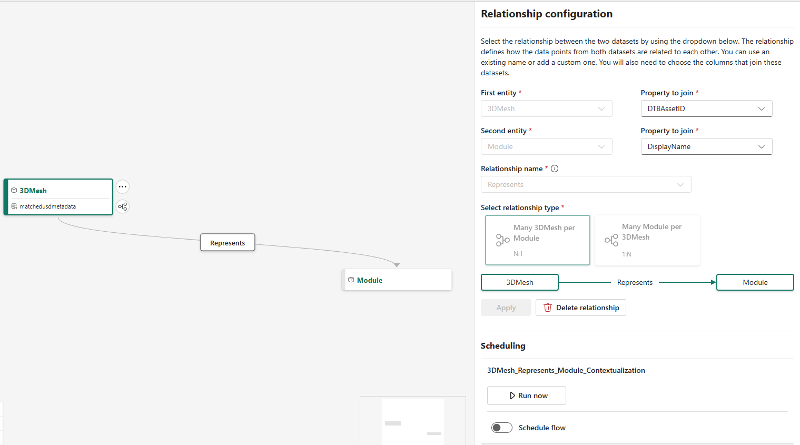
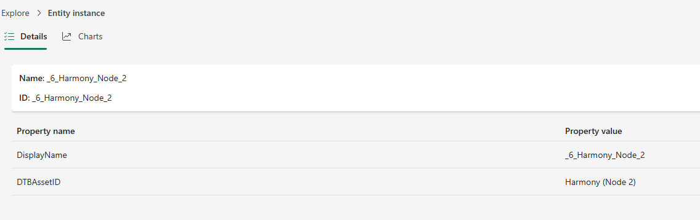
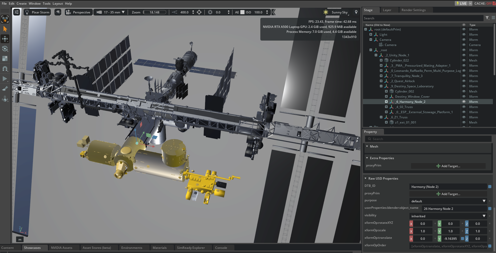

# 3D USD Import and Export For Digital Twin Builder

## Overview

Welcome to this demo showing USD Import for Digital Twin Builder. This demo leverages the OpenUSD libraries to extract relevant 3D metadata from within a file, and allows users to contexualize 3D alongside traditional IT and OT Data in a Digital Twin, all within Fabric. We aim to provide an intitial "Getting Started" jumpstart point for users wishing to include 3D Files within their digital twin data estate.

This repo aims both to provide the Notebook and flow on how users can contextualize their own 3D, as well as a demo to show how this is possible. The demo uses data from the International Space Station representing a series of Modules, and a [3D Model build by NASA](https://science.nasa.gov/resource/international-space-station-3d-model/).

Our Digital Twin will be quite simple, as we want to focus this workflow an apporach to 3D Data Matching, however if there is an appetite to build out an entire Digital Twin of the ISS, please log an issue as a Feature Request!

## Table of Contents

* [Getting Started](#Getting-Started)
* [Prerequisites and Digital Twin Setup](#Prerequisites-and-Digital-Twin-Setup)
* [Notebook Setup and Demo Runthrough](#Notebook-Setup-and-Demo-Runthrough)
* [Next Steps](#Next-Steps)
* [FAQ](#FAQ)

## Getting Started

This repo makes use of a few core pieces of software:

### Microsoft Fabric

[Microsoft Fabric](https://www.microsoft.com/microsoft-fabric) is an end-to-end, unified analytics platform designed to bring together all data and analytics tools into one place. It aims to provide a single environment for data professionals and business users to collaborate on data projects, covering everything from data ingestion and storage to processing and analysis.

### Digital Twin Builder

Within Fabric, the core technology leveraged is the Digital Twin Builder (DTB) from Fabric Realtime Intelligence. This makes it easy to build detailed, accurate representation of real-world operations. We can use Digital Twin Builder to define components, assets and other concepts as Entities, and relate these to represent this as a system. More info and Demos can be found at: [Digital Twin Builder](https://www.microsoft.com/microsoft-fabric).

### OpenUSD

[OpenUSD](https://openusd.org/release/index.html) is a file standard for extending and interchanging 3D Formats. Originally designed by Pixar for use in the SFX world, it has since grown traction in the Industrial space as a fantastic file format for interchanging 3D, as well as enriching 3D with relevant semantic information and metadata.

## Prerequisites and Digital Twin Setup
* Microsoft Fabric Instance
* 3D File/s
* Digital Twin Builder, with Mapped Entities related to the 3D file.

*For the sake of this demo, we are providing the steps to set up DTB, as well as a 3D file within the Repo.*

We will need to prepare Fabric, and our DTB instance so we can match our files within it. Within this repo are three Files

   * `modules.csv` -  A table of modules within the ISS.
   * `iss.usd` -   A 3D File of the ISS.
   * `openusd_msfabric_toolkit-0.1.0-py3-none-any.whl` -  A wheel file containing the packages needed for Manipulating USD and Fabric.
   * `USDforDTB.ipynb` -  The notebook including relevant code to run this Demo.

### Fabric Prep

1. Create new Workspace within Fabric
2. Create a Lakehouse within Fabric
    * Within the Workspace, click 'New Item' in the top left and look for 'Lakehouse'
3. Upload the following files into the Lakehouse:

   * `modules.csv` -  A table of modules within the ISS.
   * `iss.usd` -   A 3D File of the ISS.
   * `openusd_msfabric_toolkit-0.1.0-py3-none-any.whl` -  A wheel file containing the packages needed for Manipulating USD and Fabric.    
4. Go back to the Workspace, In the top Left of the Workspace, click 'Import..' and Select 'Notebook > From this Computer'
    * Select the `USDforDTB.ipynb` from your Local Machine


5. Under the 'Files' Directory, right click on `modules.csv` and load this into 'New Table'. You can leave this called modules.

### Digital Twin Builder Preparation

We will be creating a series of Modules within our Digital Twin instance to represent the physical [Modules of the International Space Station](https://en.wikipedia.org/wiki/Assembly_of_the_International_Space_Station#Assembly_sequence). The uploaded Modules table has all the relevant info we need to create a series of twins from this data.

1. Create a new 'Digital Twin Builder' Item
    * Within the Workspace, click 'New Item' in the top left and look for 'Digital Twin Builder'

*Once in the Digital Twin Builder, we will create two Entities*

2. Click 'Add Entity' and name this Entity 'Module'. This will create Entity Instances of the various Modules on the ISS
3. Click 'Add Entity' and name this Entity '3DMesh'. This will contain Entity Instances for each 3D Representation found within the 3D file.
4. Click on the Entity 'Module' and click on 'Mappings' Tab, Click 'Add Data' within the tab
5. Within the new window that appears, click 'Select Lakehouse Table'
6. Select the Lakehouse created above, and the 'Modules' table within it.
7. For 'Unique ID' select 'Module'
    * The Unique ID is our Unique Identifier for any Entity Instances that get created.
8. For Under 'Mapped Properties' select:
    * 'Module' for DisplayName 
    * Add a new field, create 'Description' for Description
    * Click Apply once done
9. Save this config, and go to the 'Scheduling' Tab and run this mapping job now.


*the Module Mapping Config should look as follows*

After a few minutes, you may want to click 'Explore' in the top right of the DTB Canvas to view the created Entity Instances, you may monitor the Mapping job by clicking 'Manage Operations' on the toolbar.


*The created Module Entity Instances within the 'Explore' Screen*

## Notebook Setup and Demo Runthrough

With the following steps, we will extract any relevant metadata embeded within the 3D file, from here we will run the notebook to extract the data, so we can use it within our Digital Twin.

### Notebook Setup

1. Open the 'USDforDTB' notebook from your Workspace
2. On the left, click 'Add Data Items' and select' Existing Data Sources' 
    * Tick the Lakehouse you created from the previous steps.
    * Tick the dtdm (digital twin data model) lakehouse, it will be named {DigitalTwinName}dtdm in the same Workspace.

Please confirm your data lakehouse (the one with the usd file) is the default lakehouse. It is indicated by a little pin next to the lakehouse. You can make sure its default by clicking the 3 dots and select 'Set as default Lakehouse'.

These steps will make our notebook have the ability to query the relevant data from these sources.

### Running through the Notebook.

The following steps are going to run through the notebook. All Steps imply you running the cell once any required configuration is done. The notebok also has documentation on each cell the mirrors this, so feel free to reference that as you go!

0. **Step 0: Install Required Imports.**

This will install any required dependencies, and the Demo Package itself.

1. **Step 1: Provide Name of USD File, Asset data Table and Lakehouse**

We will update the Python Cells below with the relevant values:

```    
# USD File Details
usd_file_name = "iss.usdc"  # Name of the USD file you want to enrich
usd_lakehouse_name = "alashjumpstart" # Name of the lakehouse in which your USD file is stored

# Asset Data Details
entity_name = "module" # Name of the Entity Type you wish to match with the USD Metadata.
dtb_item = "alashjumps2" # Name of your DTB Instance.
```

2. **Step 2: Extract Metadata from your USD File**

No need to edit anything here. We will run this cell as it will extract the relevant information from the USD and load it into a table.

3. **Step 3: Relate Asset Data and extracted USD metadata**

You may wish to set the thresholds of matching strength with the variable `fuzzy_threshold` . We are using the Fuzzy matching library called [TheFuzz](https://github.com/seatgeek/thefuzz) and setting these thresholds may produce different results.

```
Range: 0 to 100
Higher values (e.g., 90–100) = stricter matching
Lower values (e.g., 60–80) = more flexible, but may include incorrect matches
If no threshold is provided, a default of 80 will be used.
```

Setting the `entity_instance_col` Will change the column to match against, however this can be left as default for we are using the name from the DTB Data Model.

Once again, we run this cell and it will attempt to read in the entity data from DTB and make matches against the USD metadata we extracted. It will show a set of results, one with relevant matches it finds. We save these values next to the extracted USD Metadata Table.

Once this is done, we can return to DTB to bring the extracted USD Metadata into DTB. 

### Mapping Exported USD to DTB

Now that we have a table, we can go through standard DTB mapping phases to create our file, and link this to the Entities.

1. Open the DTB Item from the workspace
4. Click on the 3DMesh Entity and click on 'Mappings' Tab, Click 'Add Data' within the tab
5. Within the new window that appears, click 'Select Lakehouse Table'
6. Select the Lakehouse created above, and the 'MatchedUSDMetadata' table within it.
7. For 'Unique ID' select 'USDAssetID'
8. For 'Mapped Properties' 
    * select 'USDAssetID' for DisplayName, 
    * select 'DTBAssetID', leave this name as 'DTBAssetID'
    * click 'Apply' once done.
9. Save this config, and go to the 'Scheduling' Tab and run this mapping job now. 


*The Configured Entity*

We can now create the relationship between the two data structures:

1. Click on the three dots next to the 3dMesh and select 'Add Relationship'
2. Within the First Entity box, make sure '3DMesh' is selected, for Property to Join select 'DTBAssetID'
3. For the Second Entity, select 'Module' and for Property to Join, select 'DisplayName'.
4. Call this relationship 'Represents'
5. For Relationship type, select 'Many 3DMesh per Module (N:1)'

Once created, run this Contextualization job immediately.


*The Configured Relationship*

### Exploring Results

Once all jobs have been run (check 'Manage Operations' within DTB to confirm status) we confirm matches within the notebook by clicking 'Explore' in the top right. Clicking '3DMesh' to search through the 3DMesh Twins and typing in 'Harmony'.

By looking at this, it should have the relevant DisplayName (the USD ID) associated to it, alongside this, it has the DTBAssetID, its representation within the Digital Twin that it is linked to.


*3DMesh Instance*

### Export DTB Metadata to USD

Back in the notebook, we can also export the Model from DTB into a new USD file with the embedded asset metadata. This would allow us to embed information from the Digital Twin model back into the USD. We can use this information as a reference for 3D applications to query fabric from, or embedding static information or constraints within the file for jobs such as Simulation.

4. **Step 4: Enrich your USD File.**

You may wish to edit the `enriched_usd_file_name` value to select a specific output name. But apart from this run this cell and it will embed the DTB Asset ID into the USD file.

This has now created an enriched USD file. You may want to inspect this using such tools as [USD Composer](https://docs.omniverse.nvidia.com/composer/latest/index.html), [USDView](https://openusd.org/release/toolset.html#usdview) or even [Blender](https://www.blender.org/).


*Using the Nvidia USD Composer, we can see that the 'Harmony Node 2 has a USD Property of DTB_ID, which is the representation of the instance in Digital Twin Builder*

## Conclusion

With Import, we have extracted relevant 3D Metadata embedded within the scene, this can be handy for relating these geospatial concepts
After export, we have a 3D file with an embedded AssetID value, this value can be used a a query point to link the 3D Geometry to its relevant Twin representation within DTB. This can now be used in 3D applications as a key to query relevant information.

## Next Steps

Want to render this within Nvidia Omniverse? Check out [Nvidia Omniverse Digital Operations Twin](https://github.com/microsoft/NVIDIA-Omniverse-Azure-Operations-Twin). An end-to-end guide to get you up and running with highly detailed operational twins in Azure, using an enriched USD file created from this process.

## FAQ

*I get errors when I run through the Notebook, like my variables don't exist or libraries are not available?*

Your notebook session may have disconnected due to inactivity. Just simply re-run all previous steps to set the relevant variables, reimport libraries and other required steps.

*Some of the matches seem strange or incorrect*

We are using the [TheFuzz](https://github.com/seatgeek/thefuzz) to help out with matching, you may wish to tweak some setting on the fuzzy matching strategies within this Library to help fine tune everything.

*Most of the matches seem correct, however How can I manually edit the results?*

For now you can edit the Table per standard Spark methods, however we will plan to update this repo to allow for inline manual edits, or multiple matching strategies.
